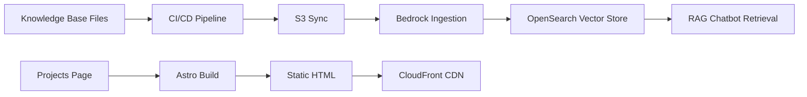

# Design Document

## Overview

This feature creates a comprehensive set of knowledge base documents and code samples that showcase Jacob's professional portfolio projects. The content is structured for optimal retrieval by the Amazon Bedrock RAG chatbot and also updates the projects page with new ProjectCard entries.

The design covers:
- 12 new knowledge base project documents (Markdown with YAML frontmatter)
- 3 new code sample files (Python, SQL, TypeScript with comment-style frontmatter)
- Updates to the Astro projects page with new ProjectCard components
- Content quality standards for vector search retrieval

All content follows the existing knowledge base conventions: YAML frontmatter with `source-type`, `category`, and `title` fields, keyword-rich prose written in third person, and clear H2/H3 headers for semantic chunking during Bedrock ingestion.

## Architecture

The feature is purely content-driven with no new runtime components. It integrates into the existing pipeline:



### Content Flow

1. **Authoring**: New Markdown and code files are created in `knowledge-base/projects/` and `knowledge-base/code-samples/`
2. **Ingestion**: The existing `scripts/ingest.ts` pipeline parses frontmatter, chunks content, filters excluded terms, and uploads to S3
3. **Embedding**: Bedrock Knowledge Base ingestion job generates vector embeddings via Titan Text Embeddings V2
4. **Retrieval**: RAG chatbot queries OpenSearch Serverless to find relevant chunks and generates responses via Claude Haiku

### Projects Page Update

The `src/pages/projects.astro` page receives new `ProjectCard` components. The existing component interface (`title`, `description`, `technologies`, `sourceUrl?`, `liveUrl?`) is sufficient — no component changes needed.

## Components and Interfaces

### Knowledge Base Document Interface

All project documents follow this structure:

```markdown
---
source-type: project
category: <category-slug>
title: <Descriptive Title>
---

# <Title>

## Project Overview
<High-level description with keywords>

## Architecture
<Technical architecture details>

## Design Decisions
<Key decisions with rationale>

## Technologies
<Bullet list of technologies>
```

### Code Sample Interface

Code samples use comment-style frontmatter:

```python
# ---
# source-type: code-sample
# category: <category-slug>
# title: <Descriptive Title>
# language: <python|sql|typescript>
# project: <project-slug>
# ---
```

For TypeScript/SQL files, the comment prefix is `//` or `--` respectively.

### ProjectCard Component Interface (existing)

```typescript
interface Props {
  title: string;
  description: string;
  technologies: string[];
  sourceUrl?: string;
  liveUrl?: string;
}
```

### File Manifest

| File Path | Type | Category |
|-----------|------|----------|
| `knowledge-base/projects/candidates-portal.md` | project | serverless-architecture |
| `knowledge-base/projects/livekit-interview-platform.md` | project | real-time-infrastructure |
| `knowledge-base/projects/livekit-ai-agents.md` | project | ai-ml |
| `knowledge-base/projects/dev-data-etl.md` | project | data-engineering |
| `knowledge-base/projects/shared-components-architecture.md` | project | software-architecture |
| `knowledge-base/projects/virtual-proctoring-standby.md` | project | real-time-infrastructure |
| `knowledge-base/projects/platform-migration-strategy.md` | project | platform-modernization |
| `knowledge-base/projects/ai-development-testing.md` | project | developer-productivity |
| `knowledge-base/projects/developer-tooling-infrastructure.md` | project | devops |
| `knowledge-base/projects/payment-platform-migrations.md` | project | payments |
| `knowledge-base/projects/database-refresh-pipeline.md` | project | devops |
| `knowledge-base/projects/chrome-kiosk-extension.md` | project | security |
| `knowledge-base/code-samples/python-serverless-patterns.py` | code-sample | serverless |
| `knowledge-base/code-samples/sql-serverless-patterns.sql` | code-sample | database |
| `knowledge-base/code-samples/typescript-serverless.ts` | code-sample | serverless |
| `src/pages/projects.astro` | page update | — |

## Data Models

### Frontmatter Schema

**Project documents:**
```yaml
source-type: "project"          # Required, always "project"
category: string                # Required, kebab-case category slug
title: string                   # Required, human-readable title
```

**Code samples:**
```yaml
source-type: "code-sample"      # Required, always "code-sample"
category: string                # Required, kebab-case category slug
title: string                   # Required, human-readable title
language: string                # Required for code samples
project: string                 # Optional, associated project slug
```

### Content Quality Model

Each document must satisfy these constraints for effective RAG retrieval:

| Constraint | Rule |
|-----------|------|
| Headers | H2 for major sections, H3 for subsections |
| Person | Third person ("Jacob") |
| Keywords | Specific tool/service names throughout |
| Self-contained | Each chunk answerable without external context |
| Excluded terms | No company names (filtered by ingest pipeline) |
| Technology framing | Modern stack prioritized; legacy framed as patterns |

### Ingestion Pipeline Compatibility

The existing `ingest.ts` pipeline handles:
- Markdown files: standard `---` YAML frontmatter via `gray-matter`
- Code files (`.ts`, `.py`, `.tf`, `.go`, `.rs`): comment-style frontmatter (`// ---` or `# ---`)
- SQL files (`.sql`): **Not currently supported** — the `parseCodeFrontmatter` function only handles `//` and `#` comment prefixes

**Design Decision**: SQL code samples will use `--` comment prefix for frontmatter. The ingest pipeline's `parseFile` function checks extensions against `['.ts', '.js', '.py', '.tf', '.go', '.rs']`. Since `.sql` is not in this list, it will fall through to the standard `matter()` parser which expects `---` delimiters. We have two options:

1. **Option A**: Add `.sql` to the code file extensions list in `ingest.ts` and update `parseCodeFrontmatter` to handle `-- ` prefix
2. **Option B**: Use a Markdown wrapper file instead of raw SQL

**Chosen**: Option A — add `.sql` support to the ingest pipeline. This is a minimal change (add extension to array, add comment prefix detection) and keeps code samples in their native file format.

## Correctness Properties

*A property is a characteristic or behavior that should hold true across all valid executions of a system — essentially, a formal statement about what the system should do. Properties serve as the bridge between human-readable specifications and machine-verifiable correctness guarantees.*

### Property 1: Document Structure Validity

*For any* generated knowledge base file (project document or code sample), parsing its frontmatter SHALL produce a valid metadata object with non-empty `source-type`, `category`, and `title` fields, AND the document body SHALL contain at least two H2-level headers (`## `) for project documents.

**Validates: Requirements 1.1, 2.1, 3.1, 4.1, 5.1, 6.1, 7.1, 9.1, 10.1, 12.1, 13.1, 14.1, 15.1, 17.1, 18.1, 19.1**

### Property 2: Ingestion Pipeline Compatibility

*For any* generated knowledge base file, passing it through the existing `parseFile` function SHALL return a non-null `ParsedDocument` with valid metadata, AND passing the content through `chunkText` SHALL produce at least one non-empty chunk, AND no chunk SHALL be excluded by `shouldExcludeChunk` (i.e., content must not contain excluded terms like company names).

**Validates: Requirements 1.1, 9.1, 9.5**

### Property 3: Code Sample Comment Density

*For any* generated code sample file, the ratio of comment lines (lines starting with `#`, `//`, or `--` after trimming) to total non-empty lines SHALL be at least 0.20 (20%), ensuring sufficient inline documentation for RAG retrieval without additional context.

**Validates: Requirements 5.6, 6.5, 7.4**

### Property 4: Third Person Voice Consistency

*For any* generated knowledge base document, the main content body (excluding code blocks and frontmatter) SHALL NOT contain first-person singular pronouns used as subjects ("I built", "I designed", "my project") AND SHALL contain at least one reference to "Jacob".

**Validates: Requirements 9.3**

### Property 5: Technology Presentation Strategy

*For any* generated knowledge base document that references legacy systems or ColdFusion, the document SHALL contain more references to architectural pattern terms (abstraction, decomposition, migration, service, API, layer, pattern) than to CFML-specific terms (ColdFusion, CFML, CFComponent, cfquery).

**Validates: Requirements 10.7, 16.2, 16.3**

## Error Handling

### Ingestion Pipeline Errors

| Error Scenario | Handling |
|---------------|----------|
| Missing frontmatter fields | `parseFile` returns `null`, file is skipped with warning |
| Empty file content | `parseFile` returns `null`, file is skipped |
| Excluded content detected | Chunk is excluded from embedding, logged as warning |
| SQL frontmatter parse failure | Falls through to `matter()` parser; if that fails, file is skipped |

### Build Errors

| Error Scenario | Handling |
|---------------|----------|
| Invalid ProjectCard props | Astro build fails with type error — caught in CI |
| Missing technology array | TypeScript compilation error — caught in CI |
| Malformed Markdown | Astro renders as-is; no runtime error |

### Content Quality Errors

| Error Scenario | Handling |
|---------------|----------|
| Company name in content | `shouldExcludeChunk` filters the chunk; property test catches this pre-deploy |
| First-person voice | Property test catches this pre-deploy |
| Missing headers | Property test catches this pre-deploy |

### Mitigation Strategy

All content quality issues are caught by property-based tests running in CI before deployment. The ingestion pipeline's existing error handling (skip and log) provides a safety net for any content that slips through.

## Testing Strategy

### Dual Testing Approach

This feature uses both property-based tests and example-based unit tests:

**Property-based tests** (via `fast-check` + `vitest`):
- Validate universal properties across ALL generated files
- Run minimum 100 iterations per property
- Catch structural issues, voice inconsistencies, and pipeline compatibility problems
- Each test tagged with: **Feature: portfolio-project-highlights, Property {N}: {description}**

**Example-based unit tests** (via `vitest`):
- Validate specific content requirements for individual files
- Check that specific keywords, sections, and patterns exist in each document
- Verify ProjectCard props and positioning on the projects page

### Property-Based Test Configuration

- Library: `fast-check` (already in devDependencies)
- Runner: `vitest` (already configured)
- Minimum iterations: 100 per property
- Test location: `tests/properties/portfolio-content.test.ts`

### Test Implementation Plan

**Property tests** (`tests/properties/portfolio-content.test.ts`):
1. Generate arbitrary selections from the set of all generated files
2. For each selected file, verify:
   - Frontmatter parses correctly with required fields (Property 1)
   - Content passes through `parseFile` and `chunkText` without exclusion (Property 2)
   - Code samples meet comment density threshold (Property 3)
   - No first-person pronouns in document body (Property 4)
   - Legacy references use architectural framing (Property 5)

**Unit tests** (`tests/unit/portfolio-content.test.ts`):
- Verify each specific file exists with expected content sections
- Verify ProjectCard additions on projects page
- Verify Candidates Portal card positioning
- Verify no CFML in new card technology tags

### Test Data Strategy

Property tests operate on the actual generated files in `knowledge-base/`. The test discovers all files matching the feature's manifest and validates properties against each one. This ensures that any future edits to the content still satisfy the correctness properties.

### CI Integration

Tests run as part of the existing `npm run test` command (vitest). The CI pipeline (`deploy.yml`) runs tests before building and deploying, so content quality issues block deployment.

