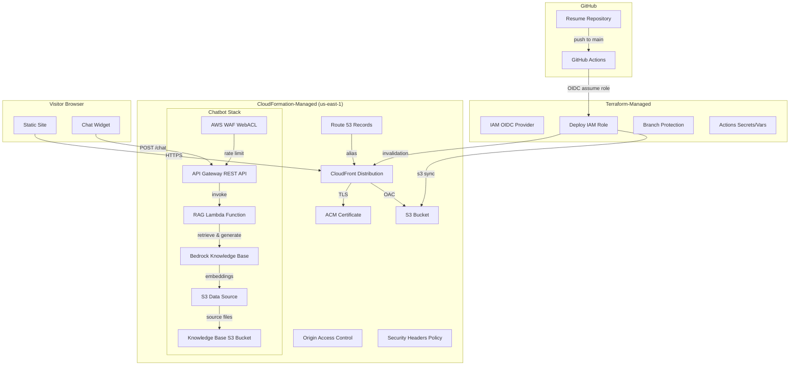
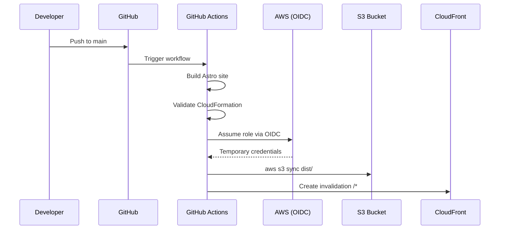

# Design Document

## Overview

This design describes the architecture for a resume/portfolio site at `resume.jacob.steelsmith.org`, built as a standalone repository separate from the existing blog. The project uses a hybrid IaC approach: CloudFormation for AWS hosting infrastructure and Terraform for cross-platform resources. It includes a RAG-based AI chatbot powered by Amazon Bedrock Knowledge Bases.

The system comprises five major subsystems:

1. **Static Site (Astro)** — Generates HTML/CSS/JS at build time for all pages (homepage, resume, projects, architecture, contact) with SEO metadata, responsive layout, and an embedded chat widget.
2. **AWS Hosting Infrastructure (CloudFormation)** — S3 bucket, CloudFront distribution with OAC, ACM certificate, Route 53 DNS records, security headers, API Gateway, Lambda, and Bedrock Knowledge Base resources.
3. **Cross-Platform Configuration (Terraform)** — GitHub OIDC provider, IAM deploy role, branch protection, and Actions environment secrets/variables.
4. **CI/CD Pipeline (GitHub Actions)** — OIDC-authenticated build and deploy workflow with CloudFormation validation on PRs.
5. **RAG Chatbot (Bedrock)** — Knowledge base content ingestion, vector embeddings via Titan Text Embeddings V2, semantic retrieval, and conversational response generation with content filtering.

### Key Design Decisions

| Decision | Choice | Rationale |
|----------|--------|-----------|
| Vector store | Amazon Bedrock managed (OpenSearch Serverless auto-provisioned) | Reduces operational overhead; Bedrock handles index lifecycle |
| Embedding model | Amazon Titan Text Embeddings V2 (1024 dimensions) | Native Bedrock integration, flexible dimensions, optimized for RAG |
| Foundation model | Anthropic Claude 3 Haiku on Bedrock | Low latency, cost-effective for short conversational responses |
| API type | REST API (API Gateway v1) | Usage plans and API keys for rate limiting; per-IP limiting via WAF |
| Per-IP rate limiting | AWS WAF rate-based rule on API Gateway | API Gateway usage plans don't support per-IP; WAF provides this natively |
| Chat widget state | sessionStorage | Preserves conversation within tab without persisting across sessions |
| CloudFormation stack strategy | Single stack with nested stack for chatbot resources | Keeps hosting and chatbot infra co-located but logically separated |

## Architecture



### Deployment Flow



## Components and Interfaces

### 1. Static Site (Astro)

**Responsibility:** Generate all HTML pages, CSS, JavaScript, and static assets at build time.

**Structure:**
```
src/
├── layouts/
│   └── BaseLayout.astro          # HTML shell, meta tags, nav, footer
├── pages/
│   ├── index.astro               # Homepage
│   ├── resume.astro              # Resume/CV page
│   ├── projects.astro            # Projects showcase
│   ├── architecture.astro        # Site architecture documentation
│   └── contact.astro             # Contact information
├── components/
│   ├── Navigation.astro          # Responsive nav with mobile menu
│   ├── ChatWidget.astro          # Chat overlay component
│   ├── ChatWidget.ts             # Chat widget client-side logic
│   ├── SEOHead.astro             # SEO meta tag component
│   └── ProjectCard.astro         # Project display card
└── styles/
    └── global.css                # Design tokens, responsive utilities
```

**Interfaces:**
- Input: Markdown/data files for page content
- Output: Static `dist/` directory with all HTML, CSS, JS, images
- Config: `astro.config.mjs` with `output: 'static'`, `site: 'https://resume.jacob.steelsmith.org'`, sitemap integration

### 2. CloudFormation Stack (`infrastructure/template.yaml`)

**Responsibility:** Define all AWS hosting infrastructure and chatbot resources.

**Resources:**
- `AWS::S3::Bucket` — Site hosting bucket (all public access blocked)
- `AWS::CloudFront::OriginAccessControl` — OAC for S3 origin
- `AWS::S3::BucketPolicy` — CloudFront-only read access
- `AWS::CertificateManager::Certificate` — TLS cert with DNS validation
- `AWS::CloudFront::ResponseHeadersPolicy` — Security headers (HSTS, CSP, X-Frame-Options, X-Content-Type-Options)
- `AWS::CloudFront::Distribution` — CDN with HTTP/2+3, compression, HTTPS redirect, custom error pages
- `AWS::Route53::RecordSet` (A + AAAA) — DNS alias to CloudFront
- `AWS::ApiGateway::RestApi` — Chat API endpoint
- `AWS::ApiGateway::Resource` + `Method` — POST /chat
- `AWS::ApiGateway::UsagePlan` — Global rate limit (100 req/min)
- `AWS::WAFv2::WebACL` — Per-IP rate limit (10 req/min)
- `AWS::WAFv2::WebACLAssociation` — Attach WAF to API Gateway stage
- `AWS::Lambda::Function` — RAG agent handler
- `AWS::IAM::Role` — Lambda execution role (least-privilege Bedrock access)
- `AWS::Bedrock::KnowledgeBase` — Knowledge base with Titan Embeddings V2
- `AWS::Bedrock::DataSource` — S3 data source pointing to knowledge base bucket
- `AWS::S3::Bucket` — Knowledge base content bucket

**Parameters:**
- `DomainName` (default: `resume.jacob.steelsmith.org`)
- `HostedZoneId` (Route 53 zone for `steelsmith.org`)
- `Environment` (production/staging)
- `BedrockModelId` (default: `anthropic.claude-3-haiku-20240307-v1:0`)

**Outputs:**
- `BucketName`, `DistributionId`, `DistributionDomainName`
- `ApiEndpoint`, `KnowledgeBaseId`

### 3. Terraform Configuration (`infrastructure/terraform/`)

**Responsibility:** Manage GitHub configuration and OIDC provider.

**Files:**
```
infrastructure/terraform/
├── main.tf           # OIDC module, IAM policy, branch protection, secrets
├── variables.tf      # Input variables
├── outputs.tf        # OIDC role ARN output
├── versions.tf       # Provider version constraints
└── terraform.tfvars.example  # Example variable values
```

**Key Resources:**
- `unfunco/oidc-github/aws` module (~> 3.0) — OIDC provider + IAM role
- `github_branch_protection` — Main branch protection (1 approval, CI checks)
- `github_actions_environment_secret` — AWS_ACCOUNT_ID, OIDC_ROLE_ARN
- `github_actions_environment_variable` — S3_BUCKET_NAME, CLOUDFRONT_DIST_ID

**Backend:** S3 with DynamoDB state locking (`jacobsteelsmith-terraform-state` bucket, `resume/terraform.tfstate` key).

### 4. CI/CD Pipeline (`.github/workflows/deploy.yml`)

**Responsibility:** Automated build, validation, and deployment.

**Jobs:**
1. `build` — Checkout, install deps, build Astro, upload artifact
2. `validate` (PR only) — Lint, CloudFormation validate-template
3. `deploy-production` (main push only) — OIDC auth, S3 sync, CloudFront invalidation

**Permissions:** `id-token: write`, `contents: read`

**Pinned Actions:**
- `actions/checkout@v4`
- `actions/setup-node@v4`
- `aws-actions/configure-aws-credentials@v4`
- `actions/upload-artifact@v4`
- `actions/download-artifact@v4`

### 5. RAG Chatbot

**Responsibility:** Answer visitor questions about career, skills, and projects using retrieved context.

**Components:**

#### 5a. Knowledge Base Content (`knowledge-base/`)
```
knowledge-base/
├── skills/
│   ├── cloud-platforms.md
│   ├── programming-languages.md
│   └── frameworks-tools.md
├── experience/
│   ├── current-role.md
│   └── previous-roles.md
├── projects/
│   ├── resume-site.md
│   └── other-projects.md
├── certifications/
│   └── aws-certifications.md
└── code-samples/
    ├── typescript-example.ts
    ├── python-example.py
    └── terraform-example.tf
```

Each file includes a YAML frontmatter header:
```yaml
---
source-type: skills | experience | project | certification | code-sample
category: cloud-platforms | programming | frameworks | ...
language: typescript | python | terraform  # for code samples only
project: resume-site  # for code samples only
---
```

#### 5b. Lambda Function (`src/lambda/chat-handler/`)

**Interface:**
```typescript
// Request (from API Gateway)
interface ChatRequest {
  question: string;  // max 500 chars
}

// Response
interface ChatResponse {
  answer: string;           // max 1024 tokens
  sources: SourceAttribution[];
  filtered: boolean;        // true if content was redacted
}

interface SourceAttribution {
  title: string;
  category: string;
}
```

**Logic Flow:**
1. Validate input (question present, ≤500 chars)
2. Call Bedrock Knowledge Base `RetrieveAndGenerate` API
3. Filter response for sensitive terms (NTN, Ergometrics, encryption keys)
4. Return formatted response with source attributions

#### 5c. Chat Widget (`src/components/ChatWidget.ts`)

**State Management:**
- Conversation history stored in `sessionStorage` under key `resume-chat-history`
- Loading state, error state, character count tracked in component state

**API Interface:**
```typescript
POST https://{api-id}.execute-api.us-east-1.amazonaws.com/prod/chat
Content-Type: application/json

{ "question": "What AWS services has Jacob worked with?" }
```

**Timeout:** 30-second client-side timeout with retry button on failure.

## Data Models

### Knowledge Base Document Schema

```typescript
interface KnowledgeBaseDocument {
  // YAML frontmatter fields
  sourceType: 'skills' | 'experience' | 'project' | 'certification' | 'code-sample';
  category: string;
  language?: string;      // programming language (code samples only)
  project?: string;       // associated project (code samples only)
  title: string;
  
  // Body content (Markdown or code)
  content: string;
}
```

### Bedrock Knowledge Base Configuration

```typescript
interface KnowledgeBaseConfig {
  name: string;                          // 'resume-knowledge-base'
  embeddingModel: string;                // 'amazon.titan-embed-text-v2:0'
  embeddingDimensions: number;           // 1024
  chunkingStrategy: 'FIXED_SIZE';
  maxTokens: number;                     // 1000
  overlapPercentage: number;             // 10 (= ~100 token overlap)
  vectorStore: 'OPENSEARCH_SERVERLESS';  // auto-provisioned by Bedrock
}
```

### Chat Session State

```typescript
interface ChatMessage {
  role: 'user' | 'assistant';
  content: string;
  sources?: SourceAttribution[];
  timestamp: number;
}

interface ChatState {
  messages: ChatMessage[];
  isLoading: boolean;
  error: string | null;
}
```

### CloudFormation Parameters

```typescript
interface StackParameters {
  DomainName: string;       // 'resume.jacob.steelsmith.org'
  HostedZoneId: string;     // Route 53 zone ID for steelsmith.org
  Environment: 'production' | 'staging';
  BedrockModelId: string;   // 'anthropic.claude-3-haiku-20240307-v1:0'
}
```

### Terraform Variables

```typescript
interface TerraformVariables {
  github_repository: string;           // 'JacobSteelsmith/resume'
  s3_bucket_name: string;              // from CloudFormation output
  cloudfront_distribution_id: string;  // from CloudFormation output
  aws_account_id: string;
  aws_region: string;                  // 'us-east-1'
  environment: string;                 // 'production'
}
```

## Correctness Properties

*A property is a characteristic or behavior that should hold true across all valid executions of a system—essentially, a formal statement about what the system should do. Properties serve as the bridge between human-readable specifications and machine-verifiable correctness guarantees.*

### Property 1: SEO metadata completeness

*For any* page generated by the Astro build, it SHALL contain a unique `<title>` tag, a unique `<meta name="description">` tag, Open Graph meta tags (og:title, og:description, og:type, og:url), and a `<link rel="canonical">` tag with an absolute URL on `resume.jacob.steelsmith.org`. No two pages shall share the same title or description.

**Validates: Requirements 6.1, 6.2, 6.3**

### Property 2: Internal link resolution

*For any* internal link (relative href) found in the built HTML output, the referenced file SHALL exist within the `dist/` directory, ensuring the site is fully self-contained.

**Validates: Requirements 5.8**

### Property 3: Knowledge base file metadata validity

*For any* file in the `knowledge-base/` directory, it SHALL contain valid YAML frontmatter with a `source-type` field matching one of the allowed categories (skills, experience, project, certification, code-sample) and a `title` field.

**Validates: Requirements 9.1**

### Property 4: Chunking size and overlap invariants

*For any* valid text input processed by the ingestion pipeline, all generated chunks SHALL be between 500 and 1000 tokens in length, and any two consecutive chunks from the same source document SHALL share between 50 and 100 tokens of overlapping content.

**Validates: Requirements 10.1**

### Property 5: Code sample metadata preservation

*For any* code sample file with language and project metadata in its frontmatter, the chunking pipeline SHALL preserve the language and project association in the metadata attached to each resulting chunk.

**Validates: Requirements 10.3**

### Property 6: Ingestion error resilience

*For any* batch of knowledge base files where some files are empty or unparseable, the ingestion pipeline SHALL skip the invalid files (logging errors with file identifiers), successfully process all valid files, and produce a summary report with accurate counts.

**Validates: Requirements 10.8, 10.9**

### Property 7: Ingestion content exclusion

*For any* text chunk that contains the terms "National Testing Network", "NTN", "Ergometrics", or patterns matching encryption keys, the ingestion pipeline SHALL exclude that chunk and NOT store its embedding in the vector database.

**Validates: Requirements 10.10**

### Property 8: Retrieval threshold filtering

*For any* set of retrieved chunks with similarity scores, the RAG agent SHALL include only chunks scoring at or above the configured relevance threshold, include at most 5 chunks, and return a "not enough information" fallback message when zero chunks pass the threshold.

**Validates: Requirements 11.1, 11.4**

### Property 9: Source attribution presence

*For any* RAG agent response generated from a non-empty set of retrieved context chunks, the response SHALL include source attributions identifying each chunk's origin by title, project name, or skill area.

**Validates: Requirements 11.3**

### Property 10: Response content filtering

*For any* response text produced by the Bedrock model, the content filter SHALL detect and replace all occurrences of sensitive terms ("National Testing Network", "NTN", "Ergometrics", encryption key patterns) with a `[REDACTED]` marker, and the final output SHALL contain zero instances of any sensitive term.

**Validates: Requirements 11.6**

### Property 11: Chat input validation

*For any* string input to the chat system, the character count display SHALL equal the actual string length. *For any* string exceeding 500 characters, the chat widget SHALL prevent submission and the API handler SHALL return HTTP 400. *For any* request body missing the `question` field, the API handler SHALL return HTTP 400.

**Validates: Requirements 12.2, 12.3, 13.5**

### Property 12: Conversation history round-trip

*For any* valid conversation history (array of ChatMessage objects with role, content, sources, and timestamp fields), serializing to sessionStorage and deserializing back SHALL produce an equivalent array with all messages, sources, and timestamps preserved.

**Validates: Requirements 12.7**

### Property 13: CloudFormation resource tagging

*For any* taggable resource defined in the CloudFormation template, it SHALL include a tag with key `Environment` referencing the Environment parameter value.

**Validates: Requirements 14.4**

## Error Handling

### CI/CD Pipeline Failures

| Failure | Behavior |
|---------|----------|
| Build failure | Job fails, GitHub status check blocks merge |
| CloudFormation validation failure | PR check fails with template error details |
| OIDC auth failure | Deploy job fails, reported on commit status |
| S3 sync failure | Deploy halts, partial upload may exist (next deploy fixes) |
| CloudFront invalidation failure | Non-fatal warning; cached content serves until TTL expires |

### RAG Chatbot Errors

| Failure | Behavior |
|---------|----------|
| Bedrock model unavailable | Lambda returns 503 with "service temporarily unavailable" message |
| All chunks below relevance threshold | Return message stating insufficient information |
| Question exceeds 500 chars | API Gateway returns 400 before Lambda invocation |
| Rate limit exceeded (global) | API Gateway returns 429 with error message |
| Rate limit exceeded (per-IP) | WAF blocks request, returns 403 |
| Lambda timeout (30s) | API Gateway returns 504; widget shows timeout message with retry |
| Sensitive content in response | Filter replaces terms with `[REDACTED]` marker |

### Ingestion Pipeline Errors

| Failure | Behavior |
|---------|----------|
| Empty/unparseable source file | Log error with filename, skip file, continue processing |
| Bedrock embedding API failure | Log error, skip affected chunk, continue |
| Excluded content detected | Skip chunk silently (not counted as error) |
| Pipeline completion | Produce summary: files processed, chunks generated, embeddings stored, files skipped |

### Static Site Build Errors

| Failure | Behavior |
|---------|----------|
| Missing content file | Astro build fails, CI reports error |
| Invalid frontmatter | Astro build fails with parse error |
| Broken internal link | Build succeeds but link checker (if added) would catch |

## Testing Strategy

### Infrastructure Testing

**CloudFormation:**
- `aws cloudformation validate-template` in CI on every PR
- Manual stack deployment to staging environment before production
- cfn-lint for additional static analysis (optional enhancement)

**Terraform:**
- `terraform validate` and `terraform plan` in CI
- State stored in S3 with DynamoDB locking for safe concurrent access

### Static Site Testing

- **Build verification:** `astro build` must succeed with zero errors
- **Lighthouse CI:** Automated Performance and Accessibility scoring (target ≥90)
- **Link checking:** Verify all internal links resolve within `dist/`

### RAG Chatbot Testing

**Unit tests (Vitest):**
- Lambda handler input validation (empty question, oversized question)
- Response content filtering (sensitive term detection and redaction)
- Source attribution formatting
- Chat widget character count logic
- Chat widget sessionStorage serialization/deserialization

**Integration tests:**
- API Gateway → Lambda invocation with mock Bedrock responses
- End-to-end chat flow with test knowledge base

**Property-based tests (fast-check):**
- Content filtering correctness across arbitrary inputs
- Chunking logic invariants (overlap, size bounds)
- Input validation boundary behavior

### CI/CD Testing

- Workflow syntax validation via `actionlint`
- OIDC authentication tested on first deployment (manual verification)

### Test Configuration

- **Framework:** Vitest (consistent with existing portfolio project)
- **PBT Library:** fast-check (already used in portfolio project)
- **Minimum PBT iterations:** 100 per property
- **Tag format:** `Feature: resume-site-iac, Property {N}: {description}`
